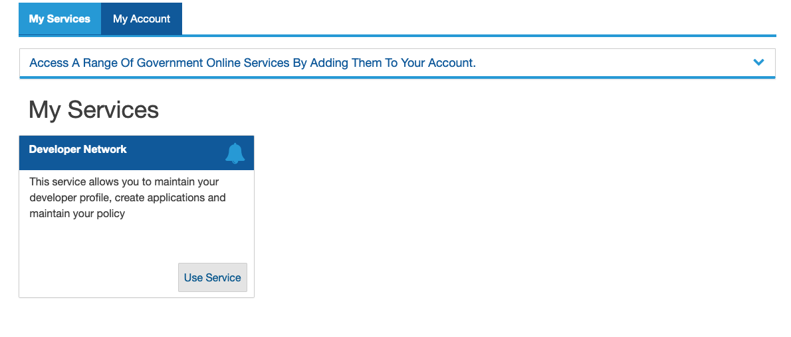
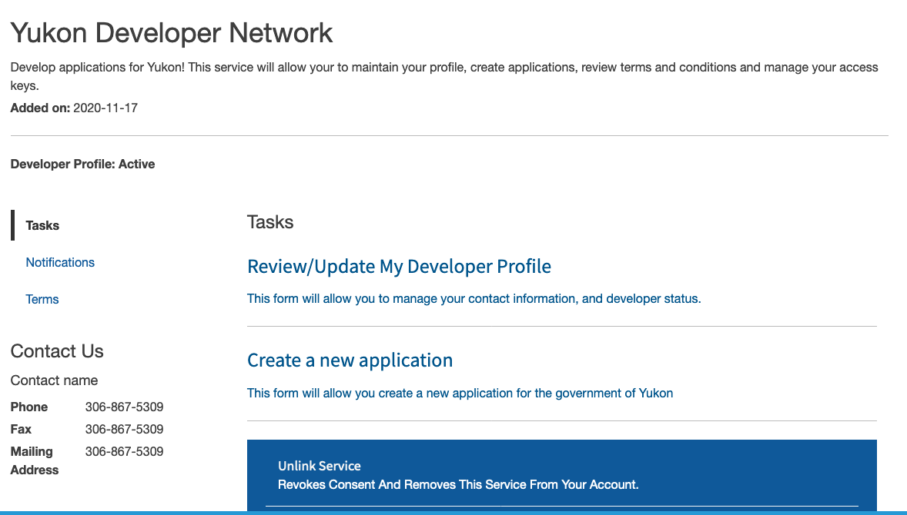
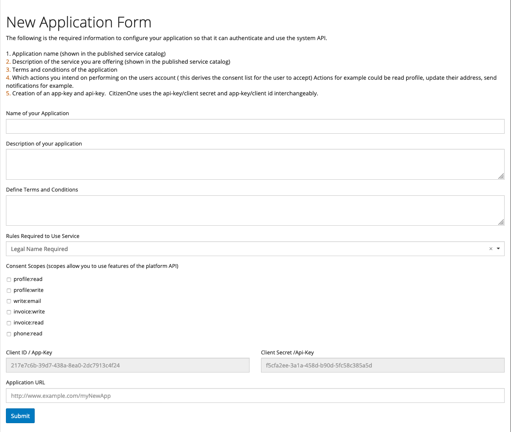
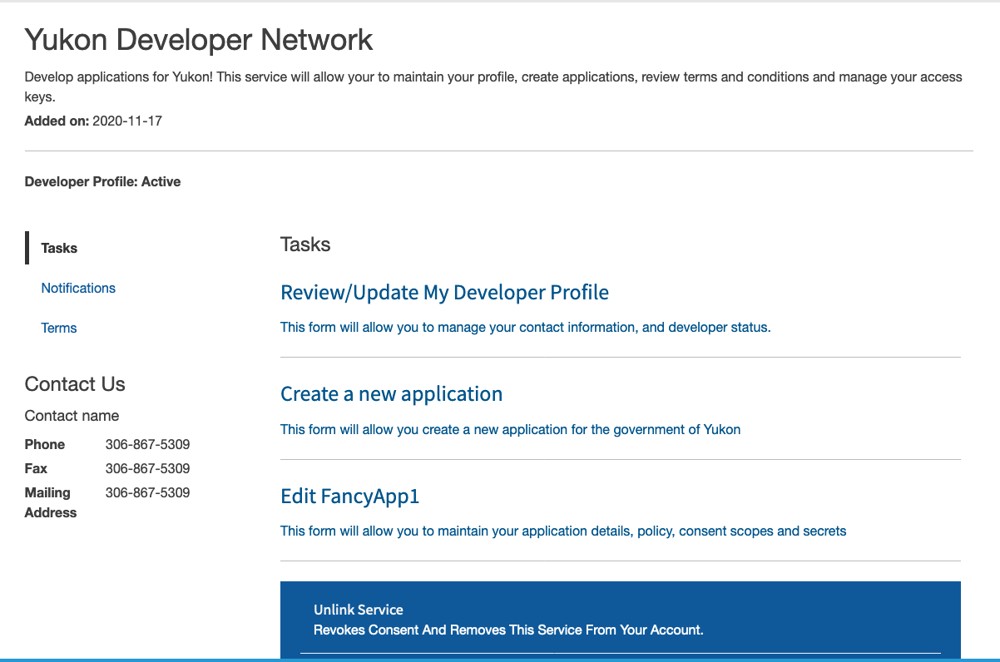

#Creating an application
##Summary
To create an application, the platform requires the following to be defined first. 

The following are conditions that you will require your users to fulfill 

* The terms and conditions of using the application
* Any rules that must be met before using your service
* Consent directives to be agreed upon

The following is the required information to configure your application so that it can authenticate and use the system API.

*  Application name (shown in the published service catalog)
*  Description of the service you are offering (shown in the published service catalog)
*  Terms and conditions of the application
*  Which actions you intend on performing on the users account ( this derives the consent list for the user to accept) Actions for example could be read profile, update their address, send notifications for example.
*  Creation of an app-key and api-key.  CitizenOne uses the api-key/client secret and app-key/client id interchangeably. 

## Getting started

* Come back to your profile and click the developer service card.

* If your profile has been approved, you will see new tasks you can perform

* Now you can perform two different tasks, 1.  Review/update your developer profile, and 2. Create a new application.

## Creating a new application

* select the "Create New Application" task from the task list

This will render a new form to capture the application details

* after you have filled in all the details of your application, please submit and you will be notified when your application is published in the catalog.

## Updating your Application

You can update your application:
 1. modify the name
 2. Change the description
 3. Change the conditions (this will force users to re-consent) 
 4. modify consent scopes (this will force users to re-consent) 
 5. Change your api-key/client secret
 
 To perform any of the above actions, come back to the developer portal and click in the task list your application name.
 
 

## Using the platform API gateway

After you have a configured application and registered secret keys, you can now begin  using the platform API.  When using the api to perform any read/write action on user accounts please remember:
1. All users need to give consent before any profile can be accessed.  This requires a user to find your service in the service catalog, add the service, review and comply with the conditions.  This established consent, which is required to access any profile information. 
2. You must be using valid active secret keys
3. Have network access to the API gateway.

Pleas use the following link for the details on using the authentication system and profile API:

[CitizenOne API Gateway](https://api.vivvo.com)
