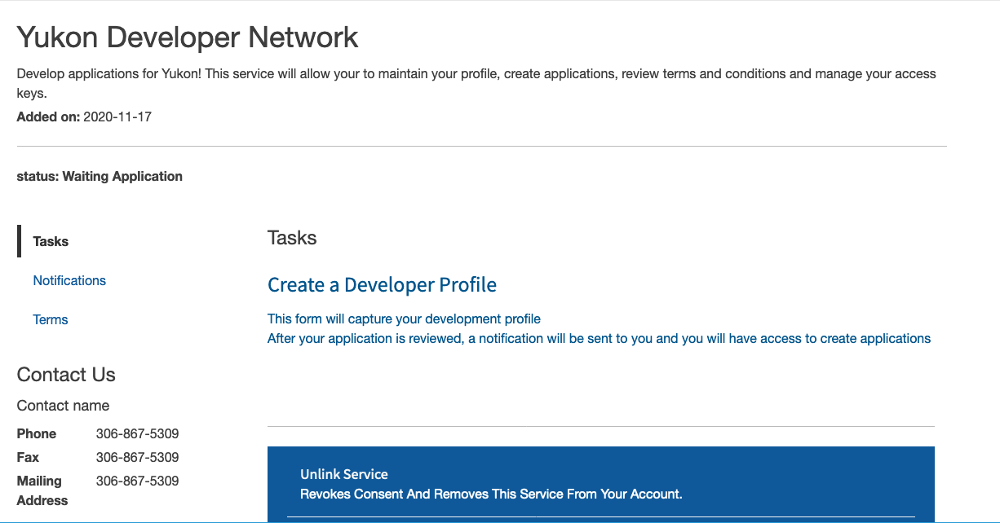
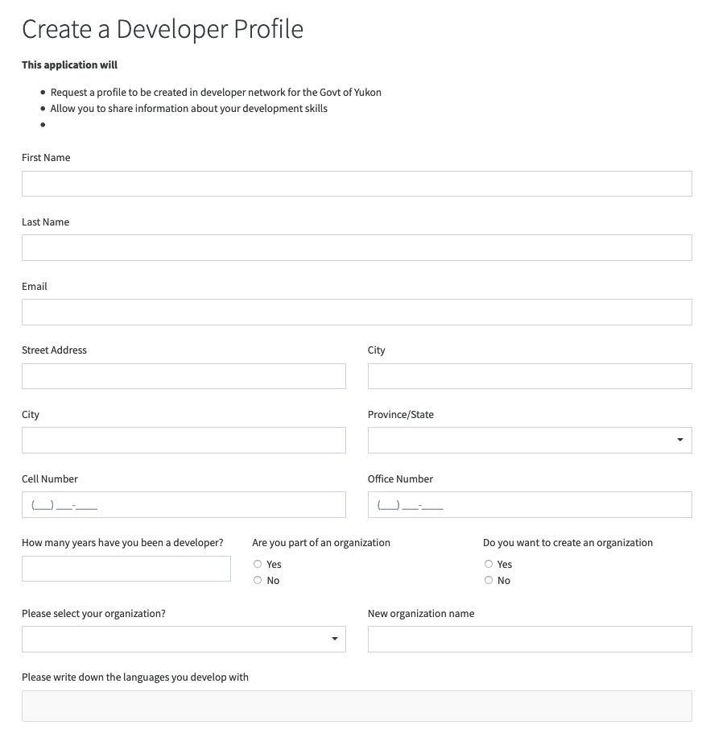

# Become a developer for Yukon Government

Do you have a great idea, or are you pursuing an opportunity, or maybe you want to show off your stuff.  This is where you should start.

## Part 1.  Create a developer profile 

Creating a developer profile will create for you an organization inside CitizenOne that enables you to create applications for the  govt of Yukon.
Each application will be associated with your organization, and will allow you to mange that application inside the developer profile area.

*  Create an account on https://services.yukon.ca 
*  In the service directory add the service called **"My Developer Profile"**
*  Use the service and review the terms and conditions
*  Select your notification preferences 
*  Agree to the consent on sharing your information with yukon.ca
*  On the next screen there will be a new link called "Create Developer Profile"

*  This link will render the following form:

After filling in the form, submit your information.  Your information will require a quick review and approval.  When you have been added to the developer network by our staff you will receive a notification. 

